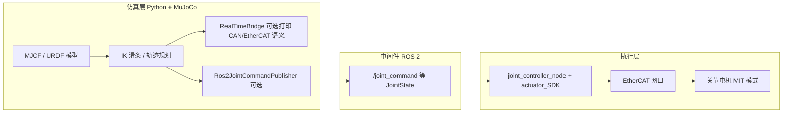

# LENS 双臂：仿真、通讯协议与 ROS2 / EtherCAT 联调（总览）

本目录聚合了**机器人描述与 MuJoCo 仿真**、**电驱协议与桥接**、**ROS2 关节控制器**等子工程。详细用法以各子包文档为准：

| 子目录 | 说明 | 文档 |
|--------|------|------|
| `lens_dual_arm_description/` | URDF/MJCF、Python 仿真（IK / 规划 / 虚拟桥接 / ROS2 发布） | [lens_dual_arm_description/README.md](lens_dual_arm_description/README.md) |
| `lens_dual_arm/` | ROS2 工作区（`joint_controller_node`、`robot_interface`、Docker 隔离编译） | [lens_dual_arm/README.md](lens_dual_arm/README.md) |
| `actuator_SDK_X86/` | 厂商 EtherCAT 静态库、`actuator_config.json` 等（路径在 YAML 中配置） | 随 SDK 自带说明 |
| `actuator_controller_aarch64/` | ARM64(aarch64) 版厂商 EtherCAT 静态库与头文件（用于在 ARM 上编译控制器） | 随 SDK 自带说明 |
| `lens_ros/`、`unitree_sdk2_python/`、`grpc/` | 其他依赖或历史工程，**与本文核心联调链无强绑定** | 各目录内文档 |

---

## 整体架构（仿真 → 通讯 → 真机）



**数据约定（关节空间）**

- 左臂 7 关节、右臂 7 关节；标准命名见 `mj_kinematics_env.py` 中 `left_joint_names` / `right_joint_names`。
- 双臂同时下发时，常见做法是 **14 个名字 + 14 个 position（弧度）**，顺序与消息中 `name` 一致；真机侧应按名字重排到驱动器顺序（若控制器实现支持）。

**MIT 阻抗/位置跟踪**

- 仿真侧若仅发布**位置**，真机节点侧通常用统一 `mit_kp` / `mit_kd`（及可选 vel/tor 偏置）调用 `setTargetMit`；具体参数在 `ethercat_control.yaml` 或命令行覆盖。

---

## 外部依赖一览

| 类别 | 组件 | 用途 |
|------|------|------|
| Python | `numpy`, `mujoco` | 仿真、雅可比 IK、几何距离避障 |
| Python（可选） | `tkinter` | 滑条 GUI（Ubuntu 需 `python3-tk`） |
| Python（可选） | `rclpy`, `sensor_msgs` | 仿真向 ROS2 发布 `JointState`（需已 `source ROS`） |
| C++ / ROS2 | ROS 2 Jazzy（示例）、`rclcpp`, `sensor_msgs`, `ament_cmake` | `joint_controller_node` |
| 厂商 SDK | `libactuator_controller.a`, SOEM 等 | EtherCAT + MIT 下发 |
| 动态库兼容 | 与 SDK 匹配的 `fmt` / `spdlog` | 避免静态库与系统库 ABI 冲突；见 Docker 构建说明 |

---

## 推荐复现顺序

1. **只跑仿真**：进入 `lens_dual_arm_description/`，按该目录 README 创建 venv、安装依赖，运行 `fk_viewer.py` 或 IK/规划脚本。  
2. **打印协议、不连真机**：设置 `LENS_BRIDGE_PROTOCOL=can` 或 `ethercat`，观察终端输出的帧/批量 MIT 语义。  
3. **ROS2 + 真机**：编译并部署 `joint_controller_node`，配置网口与 `actuator_config.json`；仿真端 `LENS_ROS_BRIDGE=1` 发布关节命令；**确保与订阅端话题名、QoS、`ROS_DOMAIN_ID`、`RMW_IMPLEMENTATION` 一致**（跨用户/ sudo 时尤其重要）。  
4. **细节与命令**：见 [lens_dual_arm_description/README.md](lens_dual_arm_description/README.md) 与 [lens_dual_arm/README.md](lens_dual_arm/README.md)。

---

## 跨架构复现（x86 → ARM，推荐做法）

当你的开发机是 **x86_64**，而部署机是 **aarch64/ARM64** 时：

- **不要**试图把 x86 构建出的镜像/二进制直接拿到 ARM 跑（除非纯算法离线验证；EtherCAT 这类强依赖网卡/权限/时序的链路不建议用 QEMU 仿真）。
- 推荐流程是：**把仓库复制到 ARM 机器 → 在 ARM 上用 ARM SDK 原生编译 → 再联调真机**。

完整步骤请按文档执行：

- [docs/ARM_复现指南.md](docs/ARM_复现指南.md)
- 一键脚本：`scripts/arm_bootstrap.sh`（会生成 `dist/arm_run_joint_controller.sh`）

---

## 与 C++ 控制器的衔接说明（务必阅读）

`joint_controller_node`（节点名 `lens_arm_controller_node`）行为：

- **订阅** `/joint_states`：读取关节反馈（零位检测等）
- **订阅** `/joint_command`（可配置 `external_joint_command_topic`）：接收 Python 仿真 / Path IR demo 发布的外部轨迹，并调用 `sendJointCommandToEthercat`
- **发布** `/joint_command`：内部动作回放时的监控输出（订阅端已忽略本节点自身发布）

联调前请用 `ros2 topic info /joint_command -v` 确认 **Subscription count ≥ 1**（`lens_arm_controller_node`），且 `ROS_DOMAIN_ID`、`RMW_IMPLEMENTATION` 与 Python 侧一致。

修改 C++ 控制器源码后需重新编译：

```bash
scripts/build_joint_controller.sh
sudo -E scripts/run_joint_controller.sh
```

---

*文档与仓库同步维护；子目录行为以源码为准。*

---

## Docker 一体化镜像（构建 / 推送 / 拉取）

将仿真、ROS2 工作区、`actuator_SDK_X86` 与编译好的 `joint_controller_node` 打入单镜像，便于在其他机器 `docker pull` 后直接使用。

- **说明与命令**：[docker/README.md](docker/README.md)  
- **快速构建**（仓库根目录）：`./docker/build-image.sh` 或 `docker build -f docker/project/Dockerfile -t lens-dual-arm:latest .`  
- **Compose**：`docker compose -f docker/docker-compose.yml run --rm lens-dual-arm bash`
